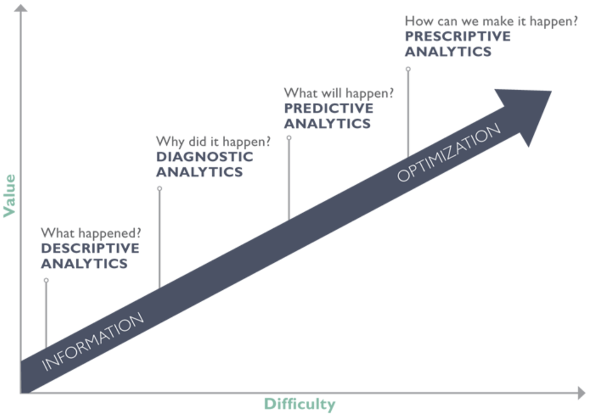
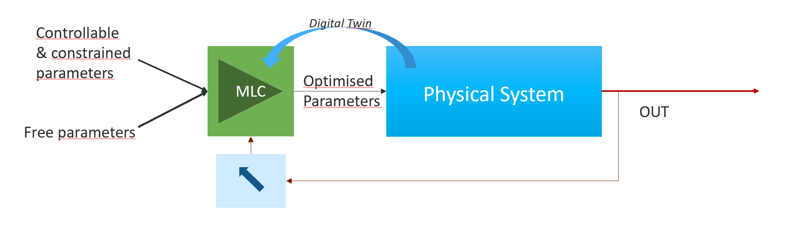
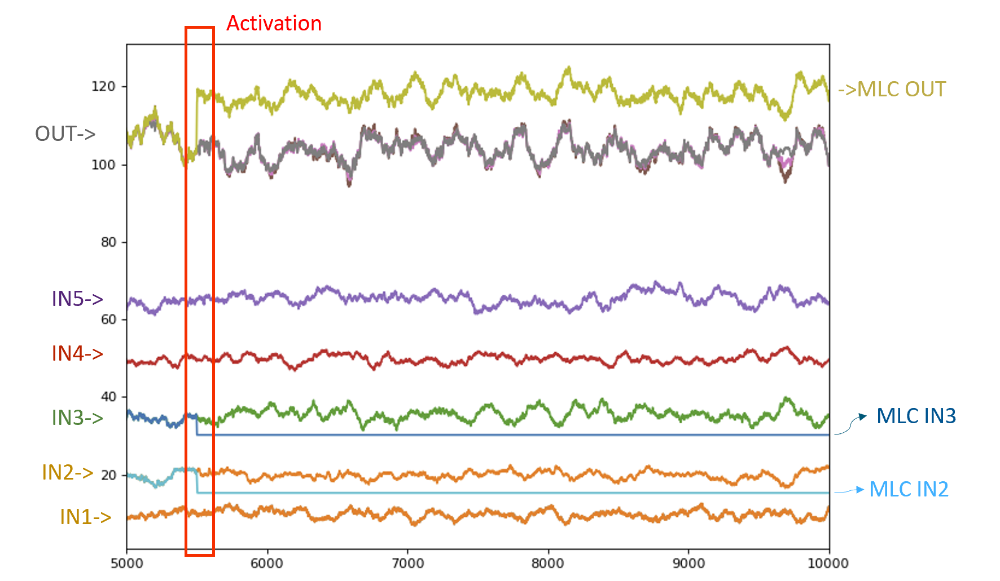

"# prescriptive_analysis" 

The very inspirational graph below is well know among the data science community. It can describe the development of analytics through the decades - descriptive analytics before 00s, diagnostic analytics and the focus on data mining after 00s, more emphase on predictive analytics with the emergence of data science and the democratization of DS tools, prescriptive analytics for the future... - or it can also describe the process workflow of a data science project in function of the effort and time that it's possible to put in. From weeks to months, either insights come from a good first statistical analysis or from a complete predictive one.

However if the first three kind of analytics are relatively obvious, the last one - prescriptive analytics - often rise questions. What is it? How to do that?

What is prescriptive analysis?

Prescriptive analytics is obviously the step following the predictive analytics. It means that once a good predictive model is available and in some situations, we would like to know what to do to have a particular output, to control it. Let's imagine the famous problem of price houses, once the price of house is predicted, one could ask what are the actionable levers to increase the price of a house depending of the model entries. Obviously some variables couldn't be easily change as the mean price of the area, the ground surface, but a better heat insulation could be considered.
In manufacturing, if the goal is to predict a performance, a yield, and moreover to increase it, prescriptive analytics would be to find how to move the actionnable variables and how to change them. It's a kind of automation with a multivariate perspective.

